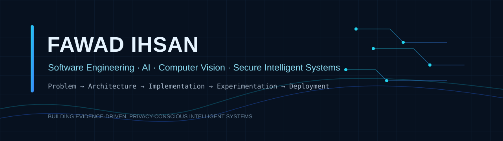

<p align="center">
  
</p>

# Fawad Ihsan

**Software Engineering Graduate | AI & Computer Vision | Secure Intelligent Systems**

I am a fresh Software Engineering graduate developing toward research in **Trustworthy AI and Secure Intelligent Systems**. I am interested in systems that can perceive, learn, adapt, and make dependable decisions in real environments while addressing robustness, security, privacy, and safety.

My engineering work spans backend development, web and mobile applications, databases, networking, system architecture, computer vision, testing, and deployment.

## Education

**BS Software Engineering**  
Abasyn University, Pakistan  

## Research Direction

My long-term direction sits at the intersection of:

```text
Artificial Intelligence + Computer Vision + Trustworthy AI
+ Cybersecurity + Cyber-Physical Systems + Software Architecture
```

I am an aspiring researcher, not an established research scientist. My current goal is to build stronger experimental foundations and turn engineering experience into careful, reproducible research.

## Research Interests

- Artificial Intelligence and Machine Learning
- Computer Vision and Video Understanding
- Trustworthy, Robust, and Privacy-Aware AI
- AI Security and Cybersecurity
- Cyber-Physical Systems
- Distributed Intelligent Systems
- Software and System Architecture
- Computer Networking

## Featured Engineering Work

### [QMSP — Quick Multi-Service Provider](https://github.com/ihsanmand/QMSP-Quick-Multi-Service-Provider)

A multi-platform local-services marketplace built around a controlled request, offer, customer-acceptance, and booking workflow.

- **Role:** Project Architect & Lead Developer
- **Platforms:** Django 5, Django REST Framework, Next.js 16, React 19, Flutter, PostgreSQL, Redis, Docker, and Nginx
- **Engineering scope:** project planning, system architecture, database design, UI/UX planning, backend and frontend development, integration, testing, production deployment, and overall technical leadership
- **Verified capabilities:** open and direct service requests, provider offers, customer-controlled acceptance, role-based booking lifecycle, OTP-controlled service start, private verification evidence, WebSockets, and authorized journey tracking
- **Intelligent foundation:** explainable rule-based pricing estimates and provider recommendation previews; these are not presented as trained machine-learning models
- **Live platform:** [qmsp.getandfix.com](https://qmsp.getandfix.com) provides the public product overview and role-secured web access
- **Source policy:** the complete implementation remains private; see the [sanitized public engineering case study](https://github.com/ihsanmand/QMSP-Quick-Multi-Service-Provider) for a public overview of the system.

I made the project, architecture, design, implementation-direction, testing, integration, and deployment decisions. AI-assisted development tools, including Codex, supported coding, debugging, and workflow execution; they did not replace project ownership or engineering judgment.

### Additional Engineering Work

**[ZARMS — Zilladar Abiana Revenue Management System](https://github.com/ihsanmand/ZARMS-Revenue-Management-System)** — An offline Windows desktop engineering project focused on exact-paisa accounting, central-ledger reporting, effective-dated history, and auditable financial corrections. The complete implementation remains private; the public repository is a sanitized case study.

### AI-Based Intelligent CCTV Threat Detection System

A computer-vision project involving CCTV/video analysis, a Kaggle-sourced dataset, YOLOv8 model training, application integration, and deployment work for suspicious-activity and weapon/violence-event detection.

- **Role:** concept, architecture, and end-to-end development leadership
- **Focus:** detection pipelines, video processing, model evaluation, integration, and operational limitations
- **Status:** planned as the second major public repository after its code, dataset usage, evidence, and limitations are reviewed

### PREVENT

A future research concept exploring multimodal AI for early threat anticipation and incident intelligence.

- **Status:** research concept, not a completed system
- **Direction:** multimodal perception, trustworthy reasoning, privacy, robustness, and responsible human oversight

## Engineering Approach

I prefer to carry systems through the complete lifecycle:

```text
Problem → Planning → Architecture → Design → Implementation
→ Experimentation → Testing → Deployment
```

- Define the real user, operational, and security problem.
- Model system boundaries, trust relationships, and data ownership.
- Build backend-authoritative workflows with focused client experiences.
- Test success paths, failure states, privacy boundaries, and concurrency risks.
- Package systems for controlled deployment without exposing secrets.

## Technical Foundation

| Area | Technologies and Practices |
| --- | --- |
| Languages | Python, Dart, JavaScript, TypeScript, SQL |
| AI and Vision | YOLOv8, OpenCV, detection pipelines, model training and evaluation |
| Backend | Django, Django REST Framework, ASGI, WebSockets |
| Web and Mobile | Next.js, React, Flutter |
| Data and Infrastructure | PostgreSQL, Redis, Docker, Nginx |
| Systems | Linux, networking, API design, database design, software architecture |
| Security | Authorization, privacy boundaries, secret handling, input validation |

## Current Focus

- Developing stronger foundations in machine learning and computer vision research
- Studying trustworthy AI, robustness, privacy, and intelligent-system security
- Publishing engineering case studies with evidence and honest limitations
- Preparing for research-focused postgraduate study and international collaboration

## Connect

- GitHub: [github.com/ihsanmand](https://github.com/ihsanmand)
- LinkedIn: [Fawad Ihsan](https://www.linkedin.com/in/fawad-ihsan-32dm)

---

Public claims on this profile are tied to real implementation, supplied project evidence, or clearly labeled future research plans. Private source code, credentials, personal data, and sensitive system details are not published.
